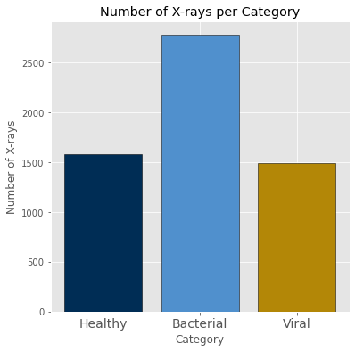
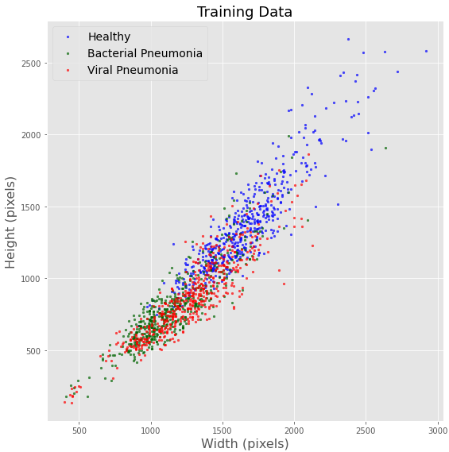
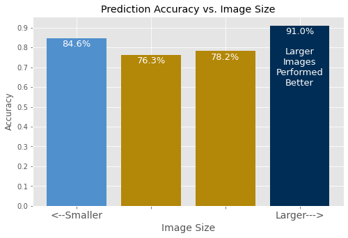

# PneumoniaDiagnosisWithCNN
This is the Phase 4 Project for the Flatiron School Data Science Bootcamp.

## Contents of Repository
|File/Folder                  | Description                                                    |
|:----------------------------|:---------------------------------------------------------------|
|[student.ipynb](https://github.com/daviderics/PneumoniaDiagnosisWithCNN/blob/main/student.ipynb)                | Jupyter notebook used to perform the analysis.                 |
|student.pdf                  | PDF of Jupyter notebook                                        |
|pneumonia_diagnosis_cnn.pdf  | PDF of the non-technical presentation for stakeholders.        |
|figures                      | Folder containing figures used in the presentation and README. |

## Overview
In this project, I used a Convolutional Neural Network (CNN) to diagnose pediatric pneumonia from chest X-rays.

## Problem
The World Health Organization (WHO) estimates that 2 million children below the age of 5 die from pneumonia every year, making it the leading cause of child mortality worldwide. The vast majority of cases and deaths are in developing countries, particularly in Africa and Southeast Asia.

Timely diagnosis of pneumonia is key for improving health outcomes for patients. It is also important to determine whether the pneumonia is caused by a bacterial or a viral infection since the treatment plans are very different depending on the cause.

One effective method of diagnosing pneumonia is by taking chest X-rays. A medical expert can identify the telltale signs of pneumonia by observing the X-rays, but some facilities in developing countries lack such an expert. This slows down the process of diagnosing the disease, leading to delays in medical intervention.

A potential solution is to create a computer model that can interpret the chest X-rays. Such a model could be made available to medical facilities across the world, helping to shorten the time it takes to diagnose pediatric pneumonia so that life-saving treatment can be provided faster.

## Stakeholder
Primarily, the goal of this work is to create a model that could be used by doctors in developing countries to make up for the lack of trained experts who can diagnose pneumonia by inspecting a chest X-ray. There is no reason why it couldn't be implemented more widely than that. Any medical facility that can take X-rays could utilize such a model.

## Data
The data was collected from https://data.mendeley.com/datasets/rscbjbr9sj/3.

The data is comprised of 5856 images of chest X-rays that were collected at the Guangzhou Women and Children’s Medical Center in Guangzhou, China. The patients were between the ages of 1 and 5 and the X-rays were taken as a part of routine medical care.

Each X-ray is labeled as either NORMAL, BACTERIA, or VIRUS. The NORMAL images are for patients that do not have pneumonia. The BACTERIA images were for patients with bacterial pneumonia and the VIRUS images were for patients with viral pneumonia. These diagnoses were made by two medical experts and verified by a third medical expert.

Below is a bar chart showing how many images are present in the dataset for each category.

The images have a wide variety of sizes and dimensions. Some were larger than 2500x2500 while others were smaller than 500x500. 

The plot above shows the dimensions of each image in the training dataset (which contains 500 of each category). The plot shows that the X-rays for healthy patients tend to be larger (higher resolution) than those of sick patients. As discussed in the next section, each image was downsampled to a common size before training the model, so I do not expect this to matter, but I do think it could be worth collecting X-rays that do not have this systematic difference between healthy and sick patients.

## Model

I used a Convolutional Neural Network (CNN) to create a model for diagnosing pneumonia from chest X-rays. The model was created iteratively by starting with a baseline model, then changing one thing at a time to see how the performance was affected. 

The table below describes both the baseline model (Model 1 in the table in the Results section) and the best-performing model (Model 5 in the Results table).

|      |Baseline Model                                    |Best-Performing Model                             |
|------|--------------------------------------------------|--------------------------------------------------|
|Input |1500 images (500 per class) downsampled to 129x180|1500 images (500 per class) downsampled to 129x180|
|Layers|4 Conv2D layers (3x3 kernel) with 32, 32, 64, and 128 filters Each Conv2D followed by a MaxPooling2D layer (2x2) Output is flattened, followed by Dense layer with 128 nodes Output Dense layer with 3 nodes All activations use ReLU function except output which uses softmax|3 Conv2D layers (3x3 kernel) with 32, 32, and 64 filters Each Conv2D followed by a MaxPooling2D layer (2x2) Each MaxPooling2D followed by Dropout layer (0.2) Output is flattened, followed by Dense layer with 64 nodes Output Dense layer with 3 nodes All activations use ReLU function except output which uses softmax|
|Regularization|No regularization                         |L2 regularization on each Conv2D and Dense layer (constant=0.005)|
|Optimizer |SGD                                            |RMSProp                                                          |
|Epochs    |80                                             |80                                                               |
|Batch size|30                                             |30                                                               |
|Loss function|categorical_crossentropy                    |categorical_crossentropy                                         |

The main changes from the baseline model to the best-performing model was that the number of Conv2D layers was reduced from 4 to 3, Dropout layers were added, regularization was added, and the optimizer was changed from SGD to RMSProp.

## Results

The table below summarizes the performance of each model that was tried. The baseline model (described in the previous section) is Model 1. Each model is the same as a previous model, but with one change and you can see what was changed in the Description column. For example, Model 2 says "1 + RMSProp optimizer" which means that it is the same as Model 1 except that it uses RMSProp as the optimizer.

The main criteria used for judging the performance were overall accuracy, binary accuracy, recall for each class, AUC values for each class, and the time to train the model. The binary accuracy refers to the accuracy if only two classes are considered (healthy vs. sick).

|Version |Description |Train Accuracy |Binary Train Accuracy |Test Accuracy |Binary Test Accuracy |Recall (healthy) |Recall (bacterial) |Recall (viral) |AUC (healthy) |AUC (bacterial) |AUC (viral) |time (s) |
|-----|------------------------|--------|--------|-------|-------|-------|-------|--------|-------|-------|--------|-------|
|1    |Baseline                |89.1%   |97.7%   |73.4%  |87.7%  |75.6%  |62.8%  |87.2%   |0.945  |0.935  |0.896   |1257   |
|2    |1 + RMSprop optimizer   |100%    |100%    |78.5%  |92.9%  |85.0%  |74.0%  |75.7%   |0.97   |0.924  |0.888   |1217   |
|3    |2 + Dropout layers      |99.9%   |100%    |83.7%  |93.6%  |89.3%  |83.9%  |74.3%   |0.971  |0.934  |0.917   |1372   |
|4    |3 + L2 regularization   |82.7%   |96.1%   |81.7%  |90.9%  |82.1%  |84.7%  |76.4%   |0.957  |0.938  |0.906   |1420   |
|5    |4 + remove a layer      |92.5%   |97.9%   |82.5%  |91.8%  |85.5%  |80.6%  |81.1%   |0.957  |0.926  |0.913   |1332   |
|6    |5 input is 172x240      |94.5%   |98.5%   |81.2%  |93.1%  |87.6%  |72.7%  |85.1%   |0.962  |0.927  |0.902   |2376   |
|7    |5 with 2400 input images|84.1%   |95.5%   |81.7%  |89.6%  |86.8%  |86.0%  |66.9%   |0.953  |0.918  |0.914   |2014   |
|8    |5 + L2 constant=0.008   |84.0%   |96.1%   |79.0%  |89.4%  |76.9%  |81.0%  |79.1%   |0.956  |0.931  |0.906   |1300   |

The best-performing model is Model 5. This model achieved 82.5% overall accuracy and 91.8% binary accuracy. This model was the only one in which the recall for each class was above 80%. Each of the other models tended to have one class that lagged behind the others in recall, but Model 5 was better balanced.

The confusion matrix for the best-performing model (Model 5) is shown below. This confusion matrix contains the 624 images that were contained in the test dataset.

**False Negatives**

The worst-case scenario for the model is predicting that a patient does not have pneumonia when they really do (colored in red in the confusion matrix). This is the worst possible outcome because the incorrect diagnosis would likely lead to a delay in receiving treatment, increasing the probability that the patient will die. Out of the 390 patients with pneumonia, the model said that 17 of them (4.4%) did not have pneumonia. Another undesirable scenario is when the model diagnoses a patient with the wrong type of pneumonia. While the model is correct that the patient has some sort of pneumonia, identifying the wrong type means that the patient might not receive the treatment they need. The model predicted the wrong type of pneumonia for 58 of the patients (14.9%). This means that the model provided the correct diagnosis for over 80% of the sick patients.

**Performance vs. Image Size**

As stated in the Data section, the images had a wide range of sizes, but were all downsampled to the same size for the model. While I expected that the downsampling would mean that the original image sizes would not matter, I still wanted to see if the accuracy was dependent on image size. I did this by dividing the 624 test images into four groups sorted by the number of pixels in the image. Below is a histogram of the accuracy for each group (smaller images on the left, larger images on the right).

The largest images did have the highest accuracy (91%). The smallest images actually had the second highest accuracy (84.6%) while the middle two groups were the lowest (78.2% and 76.3%). The fact that the largest images had the highest accuracy might seem to indicate that the model does perform better on larger images, but I do not actually think that is what's happening. Earlier, we saw that the X-rays for healthy patients tended to be larger. I think the effect seen in the graph above is down to the model performing better on images of healthy patients which just tend to run larger. The fact that the smallest images performed second best could be due to the fact that very few healthy patients had X-rays that small, so the small images just needed to distinguish between the two types of pneumonia rather than handling three classes. I would still like to have a sample that does not have a systematic difference in image size just in case it does have some effect on the performance.

## Recommendations

1. **Distributing the model to those who need it**: Having a working model only helps if those who need it are able to use it. Just like we can't assume there will be a doctor who can diagnose pneumonia from a chest X-ray, we can't assume that there will be someone who can run Python code either. I would want to work with a software engineer to productionize the model in a way that is easy to use. Ideally, I would want the model integrated into whatever software is used to display the X-ray images so that the technician only has to click one or two buttons to get a diagnosis.

2. **Closely monitor success of treatment**: While the model correctly determines whether a child has some sort of pneumonia over 90% of the time, the success rate of identifying the correct type of pneumonia is closer to 80%. I would recommend that once a treatment plan is started, the patient is monitored very closely to make sure the correct treatment has been provided. If the model says a patient has bacterial pneumonia, but is not responding to antibiotics, the doctors should keep in mind that it might still be viral pneumonia despite what the model said.

2. **Collect more uniform data**: The chest X-rays of healthy patients were typically of a higher resolution than those of patients with pneumonia. While all of the data is downsampled to a common image size before fitting the model, it is still possible that this systematic difference in the images could affect the performance of the model. I am not a doctor, so I don't know why this difference in image resolution is present in the data, but if it is possible to collect chest X-rays that do not have this class-dependent difference in resolution, then it can be checked whether this affects the model.